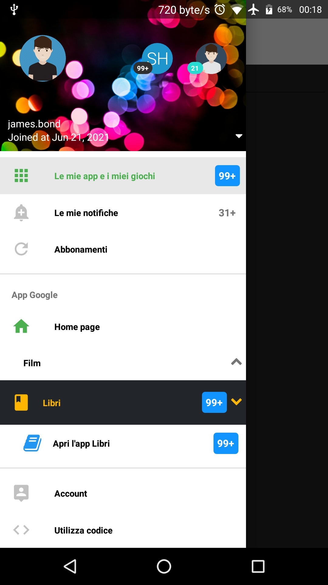

# React Native: react-native-navigation-drawer-layout

[](https://www.npmjs.com/package/react-native-navigation-drawer-layout)
[](https://github.com/gaetanozappi/react-native-navigation-drawer-layout)
[](https://github.com/gaetanozappi/react-native-navigation-drawer-layout/issues)



-   [Usage](#usage)
-   [License](#license)

## 📖 Getting started

`$ npm install react-native-navigation-drawer-layout --save`

## Usage

```javascript
import * as React from 'react';
import { StyleSheet, View, Text } from 'react-native';
import NavigationDrawerLayout from 'react-native-navigation-drawer-layout';

export default class App extends React.Component {
  constructor() {
    super();
    this.state = {
      menu: '',
      type: ''
    };
  }

  render() {
    return (
      <DrawerLayout
        percent={75}
        //statusBar="#008cff"
        //statusBarTransparency={0.3}
        type={this.state.type}
        drawerPosition="left"
        selected="opt0"
        window="menu"
        color="#fff"
        backgroundColor="#fff" //303030
        imageBackground="https://c.wallhere.com/photos/aa/44/glare_colorful_bright_circles-679384.jpg!d"
        first={'username'}
        second={'joined'}
        account={[
          {
            username: 'james.bond',
            name: 'James Bond',
            email: 'james.bond.xx@xxx.xxx',
            image:
              'https://cdn1.iconfinder.com/data/icons/avatar-2-2/512/Casual_Man_2-512.png',
            joined: 'Joined at Jun 21, 2021',
            badgeText: '100',
            badgeColor: '#fff',
            badgeBackground: '#303030',
            circle: ['transparent', 'transparent'],
          },
          {
            username: 'sherlock.holmes',
            name: 'Sherlock Holmes',
            email: 'sherlock.holmes.xx@xxx.xxx',
            badgeText: '100',
            badgeColor: '#fff',
            badgeBackground: '#303030',
            circle: ['#fff000', 'transparent', '#00ffd0'],
          },
          {
            name: 'Shinichi Kudo',
            email: 'shinichi.kudo.xx@xxx.xxx',
            image:
              'https://cdn1.iconfinder.com/data/icons/avatar-2-2/512/Casual_Man_3-512.png',
            badgeText: '21',
            badgeColor: '#fff',
            badgeBackground: '#25dbd2',
            joined: 'Joined at Jun 31, 2021',
            circle: ['transparent', 'transparent'],
          },
          {
            name: 'Arthur Conan Doyle',
            email: 'arthur.conan.doyle.xx@xxx.xxx',
            image:
              'https://cdn0.iconfinder.com/data/icons/user-interface-vol-3-12/66/68-512.png',
            circle: ['transparent', 'transparent'],
          },
        ]}
        badgeFunction={e => {
          return e > 99 ? '99+' : e;
        }}
        menu={[
          {
            type: 'menu',
            name: 'opt0',
            title: 'Le mie app e i miei giochi',
            icon: 'apps',
            colorText: '#000',
            colorTextFocus: '#4CAF50',
            colorIcon: '#c1c1c1',
            colorIconFocus: '#4CAF50',
            background: 'transparent',
            backgroundFocus: '#e8e8e8',
            badgeText: '100',
            badgeColor: '#fff',
            badgeBackground: '#1194ff',
          },
          {
            type: 'menu',
            name: 'opt1',
            title: 'Le mie notifiche',
            icon: 'add-alert',
            colorText: '#000',
            colorTextFocus: '#607D8B',
            colorIcon: '#c1c1c1',
            colorIconFocus: '#607D8B',
            background: 'transparent',
            backgroundFocus: '#e8e8e8',
            badgeText: '31+',
          },
          {
            type: 'menu',
            name: 'opt2',
            title: 'Abbonamenti',
            icon: 'refresh',
            colorText: '#000',
            colorTextFocus: '#607D8B',
            colorIcon: '#c1c1c1',
            colorIconFocus: '#607D8B',
            background: 'transparent',
            backgroundFocus: '#e8e8e8',
          },
          { type: 'divider' },
          {
            type: 'title',
            title: 'App Google',
            colorText: '#000',
          },
          {
            type: 'menu',
            name: 'opt3',
            title: 'Home page',
            icon: 'home',
            colorText: '#000',
            colorTextFocus: '#4CAF50',
            colorIcon: '#4CAF50',
            colorIconFocus: '#4CAF50',
            background: 'transparent',
            backgroundFocus: '#e8e8e8',
          },
          {
            type: 'collapse',
            name: 'opt4',
            title: 'Film',
            iconCollapsingName: 'local-movies',
            iconColor: "#ccc",
            colorText: '#000',
            colorTextFocus: '#4CAF50',
            colorIcon: '#f44336',
            colorIconFocus: '#f44336',
            background: 'transparent',
            backgroundFocus: '#e8e8e8',
            menu: [
              {
                name: 'sub0',
                title: "Apri l'app Film",
                icon: 'film',
                colorText: '#000',
                colorTextFocus: '#f44336',
                colorIcon: '#f44336',
                colorIconFocus: '#f44336',
                background: 'transparent',
                backgroundFocus: '#e8e8e8',
              },
            ],
          },
          {
            type: 'collapse',
            name: 'opt4',
            title: 'Libri',
            showOnStart: true,
            rippleColor:"#000",
            backgroundBarNormal: "#545a63",
            backgroundBarFocus: "#22252A",
            iconBarNameNormal: 'book',
            iconBarNameFocus: 'book',
            iconBarColorNormal: "#1194ff",
            iconBarColorFocus: "#ffb600",
            textBarColorNormal: "#1194ff",
            textBarColorFocus: "#ffb600",
            animateIconColorNormal:"#1194ff",
            animateIconColorFocus:"#ffb600",
            iconColor: "#ccc",
            colorText: '#000',
            colorTextFocus: '#4CAF50',
            colorIcon: '#f44336',
            colorIconFocus: '#f44336',
            background: 'transparent',
            badgeText: "100",
            badgeColor: "#fff",
            badgeBackground: "#1194ff",
            badgeRadius: 4,
            badgeStyle: {},
            menu: [
              {
                name: 'sub1',
                title: "Apri l'app Libri",
                icon: 'book',
                colorText: '#000',
                colorTextFocus: '#2196F3',
                colorIcon: '#2196F3',
                colorIconFocus: '#2196F3',
                background: 'transparent',
                backgroundFocus: '#e8e8e8',
                badgeText: '100',
                badgeColor: '#fff',
                badgeBackground: '#1194ff',
                badgeRadius: 4,
              },
            ],
          },
          { type: 'divider' },
          {
            type: 'menu',
            name: 'opt9',
            title: 'Account',
            icon: 'person-pin',
            colorText: '#000',
            colorTextFocus: '#607D8B',
            colorIcon: '#c1c1c1',
            colorIconFocus: '#607D8B',
            background: 'transparent',
            backgroundFocus: '#e8e8e8',
          },
          {
            type: 'menu',
            name: 'opt10',
            title: 'Utilizza codice',
            icon: 'code',
            colorText: '#000',
            colorTextFocus: '#607D8B',
            colorIcon: '#c1c1c1',
            colorIconFocus: '#607D8B',
            background: 'transparent',
            backgroundFocus: '#e8e8e8',
          },
          {
            type: 'menu',
            name: 'opt11',
            title: 'Lista desideri',
            icon: 'check-circle',
            colorText: '#000',
            colorTextFocus: '#607D8B',
            colorIcon: '#c1c1c1',
            colorIconFocus: '#607D8B',
            background: 'transparent',
            backgroundFocus: '#e8e8e8',
          },
          {
            type: 'menu',
            name: 'opt12',
            title: 'Play Protect',
            icon: 'verified-user',
            colorText: '#000',
            colorTextFocus: '#607D8B',
            colorIcon: '#c1c1c1',
            colorIconFocus: '#607D8B',
            background: 'transparent',
            backgroundFocus: '#e8e8e8',
          },
          {
            type: 'menu',
            name: 'opt13',
            title: 'Impostazioni',
            icon: 'settings',
            colorText: '#000',
            colorTextFocus: '#607D8B',
            colorIcon: '#c1c1c1',
            colorIconFocus: '#607D8B',
            background: 'transparent',
            backgroundFocus: '#e8e8e8',
          },
        ]}
        onPress={e => {
          this.setState({ menu: e.title });
          var type = e.name == 'opt2' ? 'simple' : '';
           this.setState({ type });
           alert(e.name)
          console.log('Menu:', e);
        }}>
        <View
          style={{
            flex: 1,
            //alignItems: 'flex-end',
          }}>
          <Text style={{ marginTop: 25, marginRight: 5 }}>Hello World!</Text>
          <Text style={{ marginTop: 25, marginRight: 5 }}>
            {this.state.menu}!
          </Text>
        </View>
      </DrawerLayout>
    );
  }
}

const styles = StyleSheet.create({});
```

## 💡 Props

| Prop              | Type       | Default | Note                                                                                                       |
| ----------------- | ---------- | ------- | ---------------------------------------------------------------------------------------------------------- |


## License
This library is provided under the Apache License.
